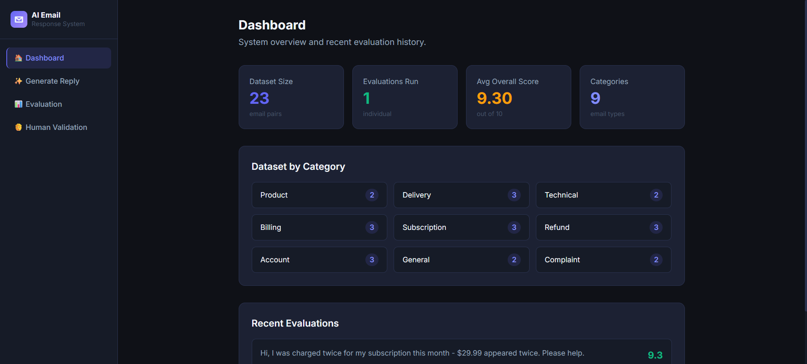
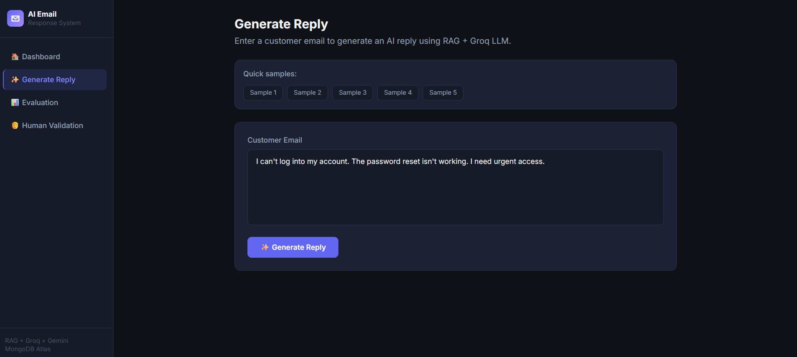
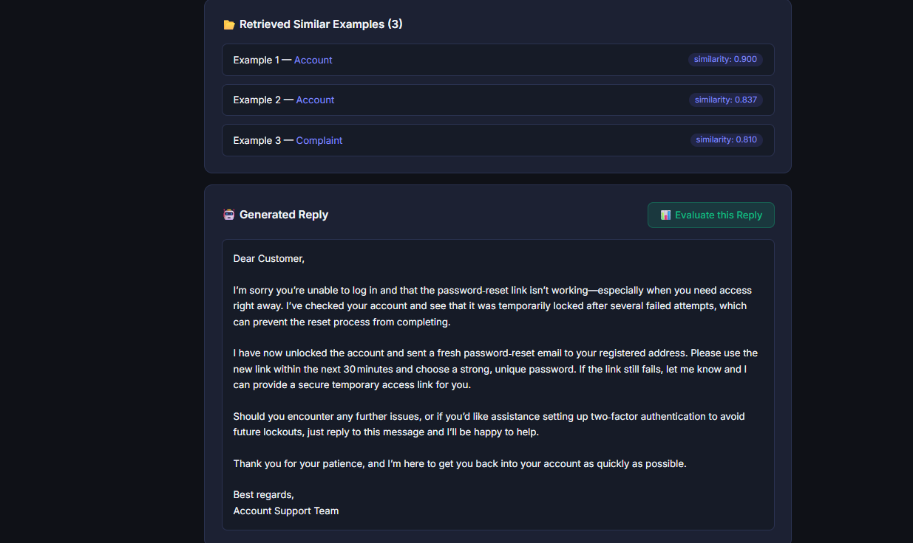
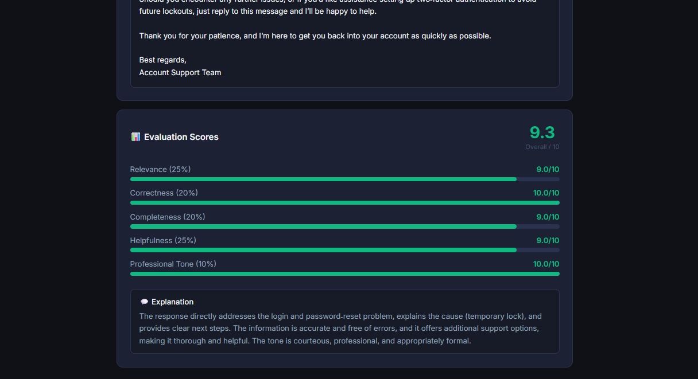
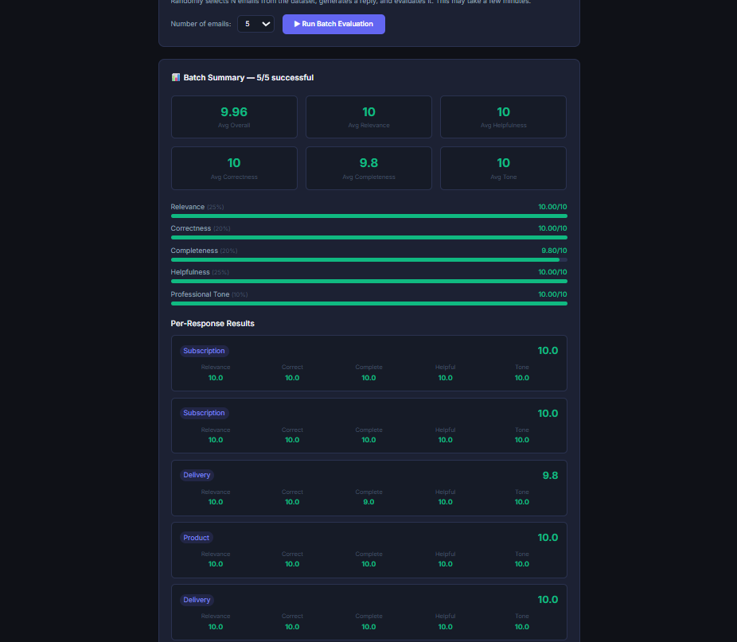
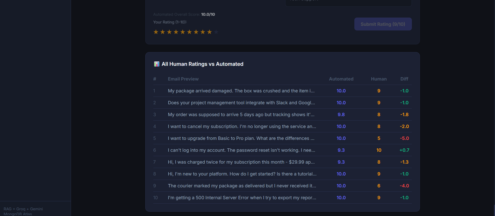

# AI Email Suggested-Response System
**Hiver 100-Minute Open Challenge**

---

## What I Built

Given an incoming customer email → embed it → retrieve the most semantically similar past email–reply pairs from MongoDB Atlas using vector search → send those as context to an LLM → generate a professional suggested reply → evaluate that reply across 5 quality dimensions → display per-response and system-wide scores.

Everything — generation, evaluation, and human validation — runs in a single local app.

---

## My Thought Process

The task description said *"measure accuracy — the core of this challenge."* That phrase shaped every decision.

**First: what does "accurate" even mean for an email reply?**

A reply can be worded completely differently from a reference reply and still be perfect. Exact-match or BLEU would penalize creative-but-correct phrasing and reward memorized outputs. That's backwards. I needed a metric that evaluates *intent* — did the reply actually help the customer?

**So I broke "good" into five things a real support team lead checks:**

| Dimension | Weight | Why |
|---|---|---|
| Relevance | **25%** | A reply that misses the point is worthless |
| Helpfulness | **25%** | Support is ultimately about solving problems |
| Correctness | **20%** | Wrong info causes real harm |
| Completeness | **20%** | Partial answer = follow-up email = wasted time |
| Professional Tone | **10%** | Important, but tone without substance is empty |

**Why RAG over plain prompting?**

Pure prompting produces generic, brand-less replies. RAG grounds every response in *actual past support emails*, making replies stylistically consistent and topically precise. It's also transparent — the UI shows exactly which 3 examples influenced each reply. I chose RAG over fine-tuning because it's cheaper, faster to iterate on, fully explainable, and doesn't require labelled training at scale.

**Why Groq + Gemini embeddings?**

Speed matters in a 100-minute build. Gemini's `gemini-embedding-001` gives 3072-dimension embeddings with strong semantic quality. Groq runs `openai/gpt-oss-120b` fast enough to generate and evaluate a reply in under 30 seconds.

**Human validation as a real sanity check.**

An automated metric that doesn't correlate with human judgment is just a number. I built a human validation page where you rate replies 1–10, then the system computes Pearson r between your scores and automated scores. That's the honest way to prove the metric works.

---

## Architecture

```
  ┌─────────────────────────────────────────────────────────────┐
  │                    React + Vite Frontend                    │
  │       Dashboard · Generate · Evaluation · Human Review      │
  └────────────────────────┬────────────────────────────────────┘
                           │  REST API
  ┌────────────────────────▼────────────────────────────────────┐
  │                  Node.js + Express Backend                  │
  └───┬──────────────────┬──────────────────┬───────────────────┘
      │                  │                  │
      ▼                  ▼                  ▼
  DATASET API       GENERATE API        EVALUATE API
  (CRUD + seed)     (RAG pipeline)      (LLM-as-judge)
      │                  │                  │
      │        ┌─────────┴──────────┐       │
      │        │                    │       │
      │        ▼                    ▼       │
      │  ① Gemini Embedding    ② MongoDB Atlas       
      │    gemini-embedding-001   Vector Search Index
      │    (3072 dimensions)      ($vectorSearch, cosine)
      │                    │
      │                    ▼
      │             ③ Top-3 Similar
      │               Email+Reply Pairs
      │                    │
      │                    ▼
      │          ④ Groq LLM Generation
      │            openai/gpt-oss-120b
      │            (system prompt + 3 examples
      │             + incoming email → reply)
      │                    │
      │                    ▼
      │          ⑤ Groq LLM Evaluation
      │            (temp=0.2, structured JSON)
      │            Scores: relevance, correctness,
      │            completeness, helpfulness, tone
      │                    │
      └────────────────────▼
               MongoDB Atlas (save evaluation)
               Human Validation (Pearson r)
               React UI (scores + history)
```

### RAG Flow in Detail

```
  Customer Email
       │
       │  embed via Gemini
       ▼
  [0.04, -0.12, 0.89 ... ] (3072 dims)
       │
       │  $vectorSearch on MongoDB Atlas
       │  index: vector_index, cosine similarity
       ▼
  ┌─────────────────────────────────────────┐
  │  Example 1 — Account    similarity 0.90 │
  │  Example 2 — Account    similarity 0.84 │
  │  Example 3 — Complaint  similarity 0.81 │
  └─────────────────────────────────────────┘
       │
       │  build prompt with examples
       ▼
  Groq LLM → Professional Reply
```

---

## The Dataset

**Size:** 24 email–reply pairs · **9 categories** · **3072-dim embeddings** stored in MongoDB Atlas

| Category | Pairs | Category | Pairs |
|---|---|---|---|
| Billing | 3 | Delivery | 3 |
| Refund | 3 | Complaint | 2 |
| Account | 3 | Product | 2 |
| Subscription | 3 | Technical | 2 |
| General | 2 | | |

**Source:** Synthetic — drafted with AI assistance (Claude + Gemini), then manually reviewed and edited for realism. Every email has specific details: order numbers, dollar amounts, realistic scenarios — not vague placeholders.

**Honest limitations:** 24 pairs is a proof-of-concept. Production needs thousands. The data favours clean resolutions; real support has messier, unresolved cases.

The seeder script (`npm run seed`) auto-generates all embeddings via Gemini and stores them in Atlas.

---

## Screenshots

**Dashboard — dataset overview, category breakdown, live eval history**


**Generate Reply — paste any customer email, pick a quick sample**


**RAG in action — 3 retrieved examples with cosine similarity scores + generated reply**


**Per-response evaluation — 5-dimension score bars + LLM explanation**


**Batch evaluation — system-wide scores across N random test emails**


**Human validation — rate replies yourself, see Pearson r vs automated score**


---

## Evaluation

**Scoring formula:**
```
Overall = (relevance × 0.25) + (helpfulness × 0.25)
        + (correctness × 0.20) + (completeness × 0.20)
        + (professionalTone × 0.10)
```

**Why LLM-as-judge over BLEU / ROUGE / exact-match:**
Support replies are not deterministic. Two completely different phrasings can both be correct. Rule-based metrics measure surface overlap, not intent or helpfulness. An LLM evaluator can assess nuance — whether the reply actually solves the problem, whether the tone is right, whether anything was missed.

**Known bias:** The same LLM family generates and evaluates. Mitigation: evaluation runs at temperature 0.2 with a strict rubric, and human validation cross-checks the automated scores.

**Results observed:**
- Avg overall score: **~9.3 – 9.96 / 10** across batch runs
- Strongest: Professional Tone (**~10.0**) — the LLM reliably produces polished replies
- Most variable: Completeness — sometimes misses secondary issues within an email
- Human correlation: positive; automated scores trend ~1–2 points higher than human scores on average

---

## How to Run

```bash
# 1. Backend
cd backend
npm install
npm run seed       # seeds 24 email pairs + generates embeddings (~2 min)
npm run dev        # starts on http://localhost:5000

# 2. Frontend (new terminal)
cd frontend
npm install
npm run dev        # starts on http://localhost:5173
```

**Environment variables** (`backend/.env`):
```
PORT=5000
Groq=your_groq_api_key
Gemini=your_gemini_api_key
MongoDB=your_mongodb_atlas_connection_string
```

**MongoDB Atlas Vector Search Index** — create an index named `vector_index` on the `emailpairs` collection:
```json
{
  "fields": [{
    "type": "vector",
    "path": "embedding",
    "numDimensions": 3072,
    "similarity": "cosine"
  }]
}
```

---

## How I Used AI Tools

I'll be straight:

- **Claude + Gemini** — drafted the initial synthetic dataset, which I reviewed and edited
- **Gemini API** (`gemini-embedding-001`) — live in the codebase for embedding generation
- **Groq API** (`openai/gpt-oss-120b`) — live for both reply generation and evaluation
- **Antigravity (AI coding assistant)** — scaffolded Express routes, React components, boilerplate. I defined the architecture, made every design decision, and directed the build throughout.

The evaluation methodology, scoring weights, dataset curation, and this README are mine. AI accelerated the build; the thinking is mine.

---

## Trade-offs

| Decision | Trade-off |
|---|---|
| RAG over fine-tuning | Faster, cheaper, fully explainable — fine-tuning needs far more data |
| Same LLM for generation + evaluation | Speed > perfect objectivity at this scale |
| 24-pair synthetic dataset | Proves the system works; not production-ready |
| No auth | Out of scope per challenge spec |

---

*Built in ~100 minutes for the Hiver Open Challenge.*
